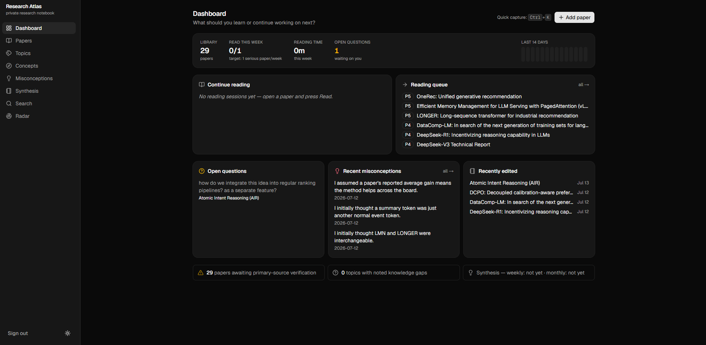
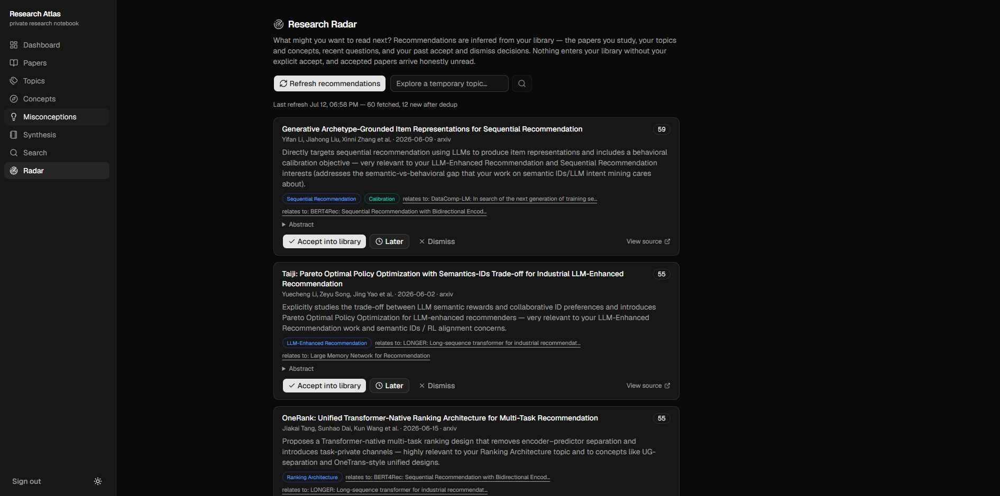

# Research Atlas

**A private, AI-assisted notebook for _thinking through_ research papers — not just summarising them.**

A paper is rarely useful only for its abstract. Most of its value is in the thinking that
happens _while you read it_: the questions it raises, the assumptions you challenge, the
connections you draw to earlier work, the implementation ideas you jot down, and the
explanations you build for the parts that are hard. That thinking is where understanding
actually forms — and it is exactly what usually gets lost, scattered across margins, chat
windows, and half-finished notes.

Research Atlas is built to **capture and develop that thinking at the moment it happens**,
with the paper itself as a first-class, interactive surface. You read the real PDF, select
the sentence that confused you, and ask about _that passage_ — grounded in the paper's own
text, with the answer preserved next to the question as part of a durable research record.
Over time the notes, questions, corrections, and connections compose into a connected
personal research library you can actually think with.

> **Privacy (read first):** for **public papers and personal learning only.** Do not enter
> confidential employer information — internal metrics, proprietary model/project names,
> private code, datasets, results, or non-public architecture. Everything is private by
> default; there are no public routes. When AI features are on, paper text and metadata are
> sent to OpenAI, and the UI says so wherever it applies. See
> [docs/privacy-and-safe-note-taking.md](docs/privacy-and-safe-note-taking.md).

## What makes it different

It is deliberately **not** a generic paper summariser or a PDF chatbot:

- **The PDF is the workspace, not an attachment.** A real pdf.js viewer with a selectable
  text layer sits at the centre. Select text in the paper and turn it directly into a
  grounded question or a note — the interaction lives _in_ the paper, not in a side chat.
- **Answers are grounded in the paper, with provenance.** Q&A retrieves the paper's own
  extracted text, cites the pages it used, separates direct paper claims from
  interpretation, and admits when the paper simply doesn't say. A selected passage is
  treated as primary evidence — the model isn't left to rediscover what you already pointed
  at. Every answer is stored with its question, model, and citations.
- **Your thinking is the artefact.** Questions, misconceptions, corrections, and
  connections are first-class records, not throwaway chat turns. AI-generated content is
  always labelled and never silently overwrites your own notes.
- **Honest by construction.** "Studied through a guide" is never the same as "verified from
  the primary paper"; statuses say what they mean, and accepting a recommendation creates
  an honestly-unread paper — never one pre-marked as understood.

## Screenshots

> Not yet captured — see [docs/screenshots/README.md](docs/screenshots/README.md) for exactly
> what to capture and where to place each file.

| Reading workspace                                            | Selection → grounded question                                |
| ------------------------------------------------------------ | ------------------------------------------------------------ |
|  |  |

| Dashboard                                    | Research Radar                       |
| -------------------------------------------- | ------------------------------------ |
|  |  |

## The reading & thinking loop

1. **Add a paper** (`/papers/new`): paste an arXiv link, DOI, title, or URL, or upload a
   PDF. Metadata resolves automatically; the AI pipeline extracts the full text, builds a
   passage-by-passage breakdown, drafts structured notes into _empty_ sections only, and
   proposes topics/concepts/priority/relevance for you to accept or reject.
2. **Read** (`/papers/[slug]/read`): a reader-first three-pane workspace — structured notes
   (editable in place) on the left, the **PDF at the centre**, and the assistant rail
   (page-linked passage summaries, annotations, Q&A) on the right. Panels collapse and
   resize; page, zoom, and layout persist.
3. **Select → ask or note**: select text in the paper and either **ask about it** (a
   question grounded in that exact passage, answered with cited pages) or **capture it as a
   note** — both remembering the page so you can jump back to the source. Annotate freely
   (notes, questions, corrections, ideas), quick-create concepts and misconceptions without
   leaving the paper, and OCR an equation screenshot to copy-ready KaTeX.
4. **View & synthesise**: `/papers/[slug]` is the clean, read-only record of everything
   accumulated; `/synthesis` drafts a weekly/monthly synthesis from your actual recorded
   activity for you to edit and approve.
5. **Discover** (`/radar`): recommendation-first Research Radar infers what to read next
   from your library itself (reading depth, topics, concepts, recent questions, past
   decisions) — metadata and abstracts only, with an explanation of why each candidate
   appeared.

Plus: a searchable/filterable library with a recoverable **trash**, a Topics landscape, a
Concepts glossary, misconception records, a dashboard with real hierarchy and a 14-day
activity view, Postgres full-text search (`Ctrl+K`), and honest reading/verification
statuses explained everywhere.

## Project status & direction

Functional and in active development as a personal tool. This stage delivered a real pdf.js
reading foundation and selection-driven, provenance-tracked Q&A and notes, plus separated
ingestion/Q&A rate budgets. The intended next stage is **hybrid retrieval** — adding
semantic (vector) search alongside the current lexical retrieval so questions phrased in
your own words retrieve the right passages. The selection and Q&A code is structured so that
retriever can slot in behind the existing interface without reworking the interactions. See
[docs/architecture.md](docs/architecture.md) (decision log) for the reasoning.

## Stack

Next.js 16 (App Router) · TypeScript (strict) · Tailwind CSS v4 · shadcn/ui ·
Supabase (Postgres, Auth, RLS, Storage) · OpenAI (server-side only) · Zod ·
react-pdf / pdf.js · react-markdown + KaTeX + highlight.js · Vitest · Playwright.
Package manager: **npm**.

## Local development

Prerequisites: Node 20+, npm, **Docker Desktop** (local Supabase), and optionally an OpenAI
API key for the AI features.

```bash
npm install                 # also vendors the pdf.js worker into public/ (postinstall)

# 1. Start the local Supabase stack (first run downloads images)
npx supabase start

# 2. Configure the app: copy .env.example → .env.local and fill in the values
#    `supabase start` printed, plus OPENAI_API_KEY if you want AI features.

# 3. Create the schema (applies supabase/migrations/)
npx supabase db reset

# 4. Seed the starter library (papers, topics, concepts)
npm run seed

# 5. Run the app
npm run dev
```

Sign in at http://localhost:3000/login with the seed account (`SEED_EMAIL` /
`SEED_PASSWORD` from `.env.local`). Missing Supabase env vars → a setup screen; missing
OpenAI key → the app still works with AI features disabled.

The PDF viewer loads its pdf.js worker from `public/pdf.worker.min.mjs`, which
`scripts/setup-pdf-worker.mjs` copies out of `node_modules` on `postinstall` / `predev` /
`prebuild` (the copy is git-ignored, always matching the installed `pdfjs-dist`). No CDN.

### Everyday commands

| Command                                 | What it does                                                           |
| --------------------------------------- | ---------------------------------------------------------------------- |
| `npm run dev`                           | Dev server                                                             |
| `npm run seed`                          | Idempotent, non-destructive seed                                       |
| `npm run db:reset`                      | Recreate the DB from migrations (wipes data)                           |
| `npm run test`                          | Unit tests (no Supabase/OpenAI needed)                                 |
| `npm run test:integration`              | CRUD/RLS/search/pipeline tests (local Supabase + built-in OpenAI mock) |
| `npm run test:e2e`                      | Playwright flows (local Supabase + built-in OpenAI mock — no API cost) |
| `npm run lint` / `typecheck` / `format` | Hygiene                                                                |

After changing migrations: `npx supabase db reset && npm run seed`, then regenerate types
with `npx supabase gen types typescript --local > lib/supabase/database.gen.ts`.

## AI processing details

- Staged, resumable ingestion pipeline (`lib/ai/pipeline.ts`): extract text → passage
  breakdown → structured-note drafts → suggestions. Progress persists per stage; a failure
  resumes where it stopped. Every run is audited in `processing_runs`.
- **Grounded Q&A** (`lib/ai/qa.ts`) answers from the paper's persisted page text
  (`paper_pages`), lexically retrieving the most relevant pages; a selected passage is added
  as primary context. Answers carry model, coverage, cited pages, and token usage on the
  `paper_qa` row. Q&A is a lightweight interactive workload with its **own** hourly budget
  (`QA_MAX_PER_HOUR`), separate from ingestion (`AI_MAX_RUNS_PER_HOUR`), so asking questions
  never blocks processing a new paper.
- Extracted document text is untrusted input (prompt-injection guidance in every prompt).
  Outbound fetches of user URLs go through an SSRF-hardened fetcher (`lib/ai/safe-fetch.ts`):
  https-only, private/metadata hosts blocked with DNS re-checking, redirect/size/time/
  content-type caps.
- Tests run against a deterministic local mock (`tests/mocks/openai-server.mjs`, plus a mock
  arXiv feed) wired via `OPENAI_BASE_URL` / `ARXIV_BASE_URL` — CI never spends API credit.

## Production deployment

1. Create a hosted Supabase project; `npx supabase link --project-ref <ref>` then
   `npx supabase db push`.
2. Disable public sign-ups after creating your account (single-user tool).
3. Deploy to a Node host (e.g. Vercel): set `NEXT_PUBLIC_SUPABASE_URL`,
   `NEXT_PUBLIC_SUPABASE_ANON_KEY`, and `OPENAI_API_KEY` (server env only). Do **not**
   deploy the service-role key with the app.
4. Paper processing can run for a few minutes on long PDFs (`maxDuration = 300` on the
   processing route); on serverless plans with shorter limits the run fails mid-way and the
   Retry button resumes from the last completed stage.

## Docs

- [docs/architecture.md](docs/architecture.md) — decision log (ADs)
- [docs/data-model.md](docs/data-model.md) — schema reference
- [docs/research-radar-roadmap.md](docs/research-radar-roadmap.md) — future automated discovery
- [docs/privacy-and-safe-note-taking.md](docs/privacy-and-safe-note-taking.md)
- [CLAUDE.md](CLAUDE.md) — conventions for AI-assisted development

`docs/source/` is git-ignored local-only source material (purged from git history).

## License

**No license file is included yet, so this repository is _all rights reserved_ by default**
— others may view it but have no granted rights to use, copy, modify, or redistribute it.
This is an owner decision, intentionally left to the repository owner rather than guessed:

- To keep it closed while sharing the code publicly, leave it as-is (or add an explicit
  proprietary/"all rights reserved" `LICENSE`).
- To let others use it, add a permissive license (e.g. **MIT** — simple, allows reuse with
  attribution and no warranty) or a copyleft one (e.g. **AGPL-3.0** — requires that networked
  deployments of modified versions also share source). The choice affects how others may run
  and build on it; pick deliberately, then add a `LICENSE` file.
